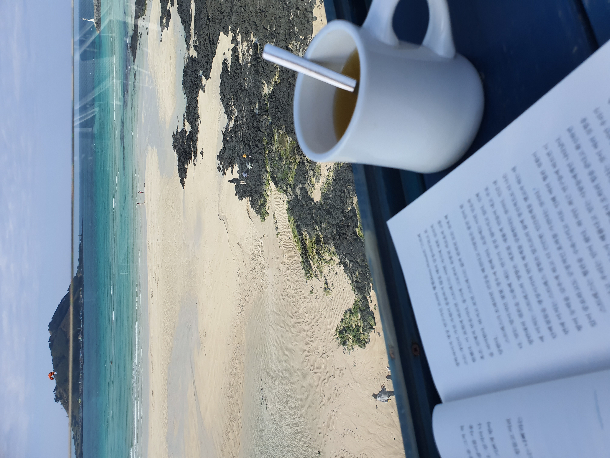

# TeamPage

> 내일배움캠프 스프링 7기 - 1주차 팀프로젝트 
> • 기간: 2024년 9월 30일 ~ 10월 7일 
> • <a herf>팀 노션 페이지<a/>

 

### 팀원

<table>
  <tr>
    <td align="center"> <b>김승하하</b> <a href="https://github.com/seondal">@gmail.coml</a></td>
    <td align="center"> <b>편효준</b> <a href="https://github.com">@gmail.com</a></td>
    <td align="center"> <b>이경섭</b> <a href="https://git-scm.com">@github</a></td>
    <td align="center"> <b>이예지</b> <a href="https://git-scm.com">@gmail.com</a></td>
    <td align="center"> <b>동우정</b> <a href="https://git-scm.com">@gmail.com</a></td>
  </tr>
</table>

  

### 기능

- 팀 소개 페이지
    

- 팀원 소개 페이지 - 팀원 CRUD
  
    

- OPEN API 활용 - 네이버 API
    

 
